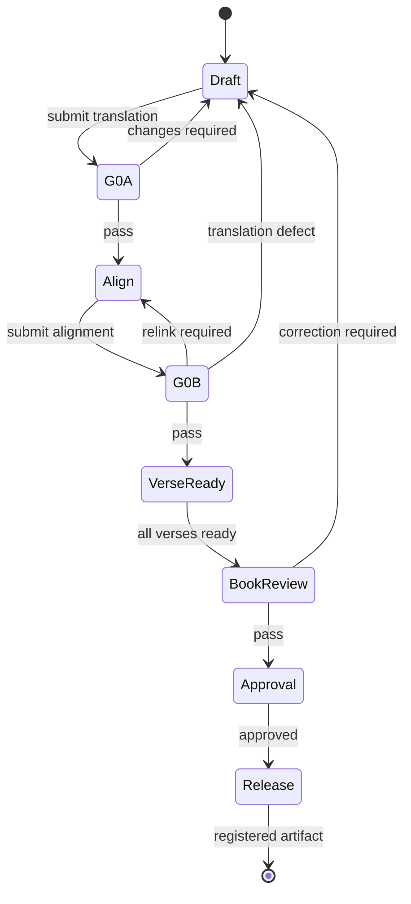

# CGV Translator Workflow Standard

**Status:** Active
**Version:** 1.2
**Scope:** LBF translation, investigation, alignment, verification, approval, and release

## 1. Authority

This document is the canonical production policy for `cgv-translator`. The Constitution governs values; this standard governs work. Schemas and implementation specifications may add detail but may not weaken these controls.

### What you decide, and what you do not

**You decide Spanish** against the tokens already in the declared source snapshot (the spine).

**You do not decide:**

- which edition is the source (that is declared when the snapshot is built);
- which physical tokens belong in the snapshot (direct OSHB word vs nested qere, tokenization);
- ketiv versus qere as a text-critical vote;
- Greek evidence for a Hebrew book, or the reverse.

If a reading is not in the snapshot, it is not the translation source. Changing that set of tokens is a new source snapshot, not a G0A question and not a translator investigation.

## 2. Required roles

| Role | Responsibility | May give final approval? |
| --- | --- | --- |
| Producer | Creates or revises translation and alignment | No |
| Translation reviewer | Performs G0A | No |
| Alignment reviewer | Performs G0B | No |
| Release approver | Accepts the completed book and authorizes publication | Yes |
| Release operator | Builds, publishes, and registers the approved artifact | No |

One person may hold multiple roles, but a producer may not be the sole reviewer of the same revision. AI may assist any role but may not be recorded as the accountable approver.

## 3. Controlled records

Every controlled record has an immutable ID, revision, author, timestamp, and status.

Required record types:

- **Source snapshot:** declared source edition, tokenization version, and checksum.
- **Translation unit:** Spanish text and its source/verse scope.
- **Alignment set:** links between translation units and source tokens.
- **Investigation:** question, evidence, conclusion, rationale, confidence, status, and affected scope.
- **Gate decision:** gate, input revision IDs, reviewer, result, findings, and timestamp.
- **Book review:** consistency checks, unresolved findings, and result.
- **Release manifest:** exact approved revisions, schema version, build ID, and artifact checksum.

No approval applies to content not identified by revision.

## 4. Common statuses

All reviews use only:

- `PENDING` — no valid decision exists for the current inputs;
- `PASS` — the identified inputs satisfy the gate;
- `CHANGES_REQUIRED` — specified correction is required;
- `BLOCKED` — a named issue prevents a decision.

`BLOCKED` must identify an owner and next action. It is never releasable.

## 5. Production state machine

An investigation may be opened from any state. Opening or editing research does not invalidate work; adopting a conclusion that changes controlled content does.

## 6. Draft translation

The Producer shall:

1. work from the declared source snapshot — the tokens in that revision, nothing else;
2. create a translation-unit revision;
3. link only investigations that actually control Spanish or alignment wording;
4. submit the exact revision to G0A.

Other translations may be consulted as evidence but may not replace accountability to the declared source.

For OT books the snapshot is the OSHB/WLC spine: direct `<w>` tokens, including ketiv. Nested qere in the edition file is not a second source. Translate the spine. A G0A reviewer checks Spanish against those tokens.

## 7. Investigation policy

Open an investigation when a **translation or alignment** decision is non-routine, disputed, materially consequential, or likely to recur (lemma Spanish, grammar, a recurring rendering).

Do **not** open a release-blocking investigation that asks a translator or G0A reviewer to choose ketiv vs qere, or to re-select tokens the snapshot already excluded. A list of unused qere forms is source documentation. It may exist as a non-blocking note. It must not block drafting, G0A, or verse PASS.

Lemma-profile and occurrence dumps must match the book's language and the investigation's question. A Greek lemma must never be written into a Hebrew investigation.

An investigation is resolved only when it contains:

- a precise question;
- relevant source occurrences or other evidence;
- alternatives considered;
- conclusion and rationale;
- confidence and known uncertainty;
- affected scope;
- accountable decision-maker.

Possible statuses are `OPEN`, `RESOLVED`, and `SUPERSEDED`. An `OPEN` investigation blocks release only when marked release-blocking **and** it actually controls Spanish or alignment content. Source-tokenization inventories are not release-blocking.

## 8. G0A — translation verification

G0A is a **book reading**, not a stack of terminal commands and not 211 separate verse audits.

**Inputs:** source snapshot revision, translation revision, linked controlling investigations, and the continuous Spanish book.

The reviewer reads the book. Check at minimum:

- the Spanish is the book you meant to publish from this snapshot;
- it represents the **spine tokens**, not an excluded qere or another edition;
- nothing material is unsupported, omitted, or distorted;
- ambiguity is preserved or resolved responsibly;
- Spanish is intelligible;
- controlling **translation** decisions are followed or explicitly challenged.

If a verse is wrong, record that verse as `CHANGES_REQUIRED` with a finding. If the book is acceptable, record one book `PASS` on this revision. Verse rows store that attestation. They are not a second review.

**Output:** a gate decision bound to the input revisions. `CHANGES_REQUIRED` must contain actionable findings. A `PASS` becomes stale automatically when any bound input changes.

## 9. Alignment

Alignment begins only after a current G0A `PASS`.

The Producer records the actual correspondence between Spanish units and source tokens. One-to-one, one-to-many, many-to-one, many-to-many, discontinuous, and intentionally unaligned relationships are allowed when accurately typed and explained where non-obvious.

Completeness must not be manufactured through false links.

## 10. G0B — alignment verification

**Inputs:** source snapshot revision, G0A-passed translation revision, alignment revision, and relevant investigations.

The reviewer checks at minimum:

- each link represents a defensible translation relationship;
- required source and Spanish units are accounted for;
- unrelated tokens are not linked;
- grammatical boundaries and discontinuities are represented accurately;
- intentional omissions, additions, or null alignments are typed and justified.

**Output:** a gate decision bound to the input revisions. Alignment findings return to Alignment. Translation findings return to Draft and make dependent G0B decisions stale.

## 11. Deterministic invalidation

| Change | G0A | Alignment | G0B | Book review |
| --- | --- | --- | --- | --- |
| Research notes only | unchanged | unchanged | unchanged | unchanged |
| Adopted decision with no content impact | unchanged | unchanged | unchanged | stale if book-wide conclusion changes |
| Spanish text | stale for affected units | review affected links | stale for affected units | stale |
| Alignment links only | unchanged | revised | stale for affected units | stale |
| Source text or tokenization | stale for affected scope | stale for affected scope | stale for affected scope | stale |
| Book-wide policy or terminology | recompute affected scope | review affected links | recompute affected scope | stale |

“Affected scope” must be stored explicitly or computed from record links. It may not be inferred only from memory.

## 12. Verse readiness

A verse is `READY` only when the current source, translation, and alignment revisions have current G0A and G0B `PASS` decisions, all release-blocking findings are closed, and every required controlling investigation is resolved.

This is a computed state, not a manually assigned approval.

## 13. Book review

When all included verses are `READY`, review the complete book for:

- terminology, names, titles, and recurring constructions;
- contextual consistency without forced uniformity;
- application of book-wide investigation decisions;
- alignment conventions and typed exceptions;
- unresolved or stale records;
- source coverage and verse inventory.

Any content correction follows the invalidation matrix. The book review passes only when rerun against the corrected revision set.

## 14. Release approval

The Release approver may approve only when:

- every included verse computes as `READY`;
- the book review has a current `PASS`;
- no release-blocking investigation or finding is open;
- the release manifest identifies every approved input revision;
- the intended edition and version are stated.

Approval is a signed decision bound to the manifest. Approval does not mutate the underlying records.

## 15. Publication and registration

The Release operator shall:

1. build from the approved manifest;
2. validate schema and referential integrity;
3. create an artifact checksum;
4. keep the release package (manifest, text, alignment) in `Biblia-LBF/releases/`;
5. publish only the consumer Bible text to `cgv-data/bibles/LBF/`;
6. verify that the published text checksum matches the manifest;
7. register the artifact ID, checksum, edition, and version with `cgv-MANAGER`.

`cgv-data` is not the home of release paperwork. Downstream work must consume the registered Bible text, not a working copy.

## 16. Corrections after release

Never overwrite a released artifact. A correction creates new controlled revisions, runs only the gates invalidated by the change, receives a new book review and approval where required, and produces a new release manifest and artifact version. Prior releases remain traceable.

## 17. Audit requirements

The system must be able to answer:

- what exact source, translation, and alignment revisions were approved;
- who made and reviewed each decision;
- what evidence supported non-routine choices;
- which change invalidated a prior decision;
- which checksum identifies the published artifact;
- what downstream process used that artifact.

If any answer depends solely on memory, chat history, or mutable notes, the workflow has failed.
