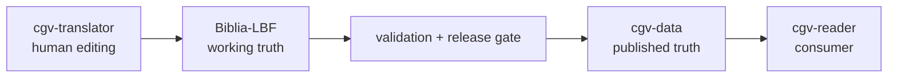
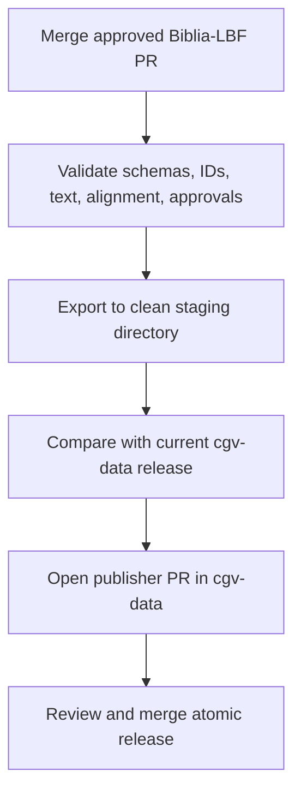

# CGV Content Architecture

Status: proposed target design  
Scope: `Biblia-LBF`, `cgv-translator`, `cgv-data`, `cgv-reader`

## Executive decision

There are two—and only two—authoritative states for LBF content:

1. **Working truth:** `Biblia-LBF` owns every editable LBF translation, alignment, review decision, and approval record.
2. **Published truth:** `cgv-data` owns immutable, validated release artifacts consumed by every application.

`cgv-translator` is an editor for `Biblia-LBF`. It does not own translation data.  
`cgv-reader` is a consumer of `cgv-data`. It does not own, repair, or publish LBF data.

No synchronization is bidirectional. The only production flow is:



## Repository contracts

| Repository | Owns | May write | Must not contain |
| --- | --- | --- | --- |
| `Biblia-LBF` | LBF source translation, source-token alignment, review state, decisions, release metadata, LBF-specific validators/exporter | Its own canonical project files | App code; copied published output treated as editable; unrelated Bibles |
| `cgv-translator` | Translator UI, API/client code, local cache, tests | Changes to `Biblia-LBF` through a defined adapter/PR workflow | Canonical verses, canonical alignments, approval truth, hand-maintained export copies |
| `cgv-data` | Versioned distribution artifacts for Bibles, songs, courses, morphology, interlinears | Automated release jobs or reviewed publisher PRs | Drafts, comments, workflow state, editor state, repair scripts, app-specific fixtures |
| `cgv-reader` | Reader/Observer/Compiler application code and app-only configuration | Local user progress and generated build cache | Canonical Bible copies, canonical alignments, translation approvals, alignment repair/generation tools |

## Canonical LBF project layout

Use one stable unit: **one JSON file per biblical book**, with stable verse and token identifiers. Avoid making Markdown the machine source of truth; Markdown may be generated for review or distribution.

```text
Biblia-LBF/
  project.json
  schema/
    lbf-book.schema.json
    lbf-alignment.schema.json
    lbf-review.schema.json
  content/
    nt/
      TIT/
        translation.json
        alignment.json
        review.json
    ot/
      DAN/
        translation.json
        alignment.json
        review.json
  decisions/
    terminology.json
    translation-notes/
  tools/
    validate/
    export/
  releases/
    0.1.0.json
```

Existing `translation/nt` and `translation/ot` content should be migrated into `content/{testament}/{book}/translation.json`; it must not be deleted until round-trip comparison proves equivalence.

### Identity rules

- Canonical book codes are uppercase OSIS-style IDs (`TIT`, `DAN`, `1JN`), not Spanish filenames.
- Verse IDs are stable: `TIT.1.1`.
- Source-token IDs are stable and derive from the licensed source dataset, for example `TIT.1.1.tr.03` or `DAN.1.1.wlc.05`.
- Target-token IDs are persisted, never regenerated from array position: `TIT.1.1.lbf.04`.
- Alignment references token IDs, never character offsets and never display positions.
- Text edits that change target tokens must explicitly reconcile affected alignment edges before approval can remain valid.

### Translation record

Each verse contains its text and persisted target tokens. It has workflow state but no app-specific UI state.

```json
{
  "verseId": "TIT.1.1",
  "text": "Pablo, siervo de Dios...",
  "tokens": [
    { "id": "TIT.1.1.lbf.01", "text": "Pablo" }
  ],
  "status": "approved",
  "revision": 12
}
```

### Alignment record

Alignment is first-class authored project data, not a derived Reader artifact.

```json
{
  "verseId": "TIT.1.1",
  "sourceEdition": "TR1894",
  "translationRevision": 12,
  "links": [
    {
      "sourceTokenIds": ["TIT.1.1.tr.01"],
      "targetTokenIds": ["TIT.1.1.lbf.01"],
      "kind": "equivalent",
      "confidence": "human"
    }
  ],
  "status": "approved"
}
```

One-to-many, many-to-one, omitted, and supplied-word relations must be representable. Automated alignment may create `draft` links, but only human review may make them `approved`.

### Review and approval

Approval must be explicit, attributable, and tied to exact content revisions.

```json
{
  "verseId": "TIT.1.1",
  "translationRevision": 12,
  "alignmentRevision": 7,
  "checks": {
    "translation": "approved",
    "alignment": "approved"
  },
  "approvedBy": "github-login",
  "approvedAt": "2026-08-17T00:00:00Z"
}
```

Any translation edit invalidates translation approval and alignment approval for that verse. Any alignment edit invalidates alignment approval. Approval records should normally be committed by pull request so Git history remains the audit log.

## Published `cgv-data` layout

Keep broad content categories, but every dataset needs an explicit manifest and version. LBF text and its reverse interlinear are one atomic release.

```text
cgv-data/
  catalog.json
  schemas/
  bibles/
    LBF/
      manifest.json
      versions/
        0.1.0/
          bible.json
          books/
            TIT.json
            DAN.json
          alignment/
            TIT.json
            DAN.json
          checksums.json
      current.json
  bibles/...
  songs/...
  courses/...
  morphology/...
```

`current.json` is a small pointer to an immutable version. Consumers may pin a version or deliberately follow `current`. The publisher must update version files and `current.json` in the same commit. Existing `interlinears/NT` and `interlinears/OT` should be retained during migration, then removed only after all consumers read `bibles/LBF/versions/<version>/alignment`.

The release manifest must record:

- dataset ID and semantic version;
- schema version;
- source repository and exact source commit SHA;
- source editions (`TR1894`, Hebrew/Aramaic edition as applicable);
- included books and approval coverage;
- build timestamp and exporter version;
- file checksums and license information.

## Release gate

Publishing is deterministic and one-way. The same `Biblia-LBF` commit must always generate byte-identical content except for explicitly separated build metadata.



The gate fails when:

- a verse lacks valid text;
- duplicate or unstable IDs exist;
- an alignment references a missing token;
- alignment revision does not match translation revision;
- selected release scope is not fully approved;
- output contains files not declared in the manifest;
- licenses do not permit distribution;
- the working tree or generated staging directory contains manual edits.

Publishing should initially create a PR in `cgv-data`, not push directly. The PR description lists source SHA, version, books changed, approval counts, and validation results.

## Application behavior

### `cgv-translator`

- Reads a chosen `Biblia-LBF` branch/commit through one repository adapter.
- Edits translation, tokenization, alignment, notes, and review state using the canonical schemas.
- Saves by producing commits/PRs to `Biblia-LBF` (or exports an exact patch for that repo).
- Displays generated previews but never writes to `cgv-data`.
- Has no private alternative database that can become more authoritative than Git. A database may be a cache or collaboration layer only if every accepted change is durably committed back to `Biblia-LBF`.

### `cgv-reader`

- Reads only `cgv-data` artifacts through a small data package/loader.
- Pins a dataset version in production builds.
- May use a sibling `cgv-data` checkout in development, but path resolution is read-only.
- Keeps user observations/progress separate from Scripture distribution data.
- Removes `data/lbf`, LBF rebuild/repair scripts, and hand-maintained LBF manifests after parity is proven.
- Alignment visualizations consume published alignment; they never fix or regenerate it in place.

## What the current repositories reveal

The present structure confirms the boundary problem:

- `Biblia-LBF` contains `translation/nt` and `translation/ot`, so it already acts as a translation source.
- `cgv-data` contains `bibles/LBF` plus `interlinears/NT` and `interlinears/OT`, so published LBF text and alignment are split by unrelated directory conventions.
- `cgv-reader` contains `data/lbf`, a book manifest, and scripts such as `rebuild-lbf-alignment.py`, `lbf-align-workbench.py`, `verify-lbf-text.py`, and multiple book-specific repair scripts. This is the accidental second authoring system.
- `cgv-translator` was not visible in the connected GitHub organization during this audit; its internal files must be inventoried before migration.

## Migration plan

### Phase 0 — freeze and inventory

1. Announce that no LBF text or alignment may be edited in `cgv-data` or `cgv-reader`.
2. Inventory every LBF verse and alignment artifact across all four repos; record path, format, count, last commit, and checksum.
3. Classify each artifact as canonical candidate, derived copy, fixture, cache, or obsolete.
4. Produce verse-by-verse and alignment-by-alignment diffs. Do not choose by file timestamp alone.
5. Resolve conflicts by documented human decision in `Biblia-LBF`.

### Phase 1 — establish the canonical project

1. Add schemas, stable IDs, validators, and `project.json` to `Biblia-LBF`.
2. Import the winning translation and alignment records.
3. Preserve provenance for every imported artifact.
4. Add approval state without pretending existing unreviewed records are approved.
5. Add tests for representative Greek, Hebrew, Aramaic, one-to-many, omission, punctuation, and supplied-word cases.

### Phase 2 — build the publisher

1. Implement a deterministic exporter in `Biblia-LBF/tools/export`.
2. Export to a temporary clean directory, never directly over a checkout.
3. Validate generated artifacts against `cgv-data` schemas.
4. Create a publisher PR containing an atomic versioned release.
5. Verify checksum and source-SHA provenance in CI.

### Phase 3 — convert consumers

1. Add a single version-aware `cgv-data` loader to `cgv-reader`.
2. Point Reader, Observer, and Compiler at the same loader.
3. Convert `cgv-translator` to the canonical `Biblia-LBF` adapter and schemas.
4. Run golden tests comparing displayed verses and alignment behavior before and after migration.

### Phase 4 — remove duplicates

1. Delete `cgv-reader/data/lbf` only after parity tests pass.
2. Move generalizable validators/export code from Reader to `Biblia-LBF`; archive one-off repair scripts with migration records, then remove them from the app repo.
3. Remove old LBF and interlinear output paths in `cgv-data` only after a deprecation window.
4. Add CI boundary checks that reject canonical LBF data in app repos and draft/review files in `cgv-data`.

## Implementation work packages for Codex

1. **Inventory command:** clone all four repos, emit `migration/inventory.json` and checksum/diff reports; make no data changes.
2. **Schema PR (`Biblia-LBF`):** add schemas, stable identifier rules, canonical layout, and validation CLI.
3. **Reconciliation PR (`Biblia-LBF`):** import all candidate text/alignment with provenance and a human-readable conflict report.
4. **Publisher PR (`Biblia-LBF`):** deterministic export plus CI and a dry-run artifact.
5. **Distribution PR (`cgv-data`):** add catalog/versioned LBF layout and first generated release without deleting legacy paths.
6. **Reader PR:** add the version-aware loader, switch all three surfaces, and prove golden parity.
7. **Translator PR:** replace local ownership with the `Biblia-LBF` repository adapter and approval rules.
8. **Cleanup PRs:** delete duplicates and legacy paths only after all migration gates pass.

Each work package must be independently reviewable. Do not combine reconciliation, consumer conversion, and deletion in one PR.

## Non-negotiable acceptance criteria

- For every LBF verse there is exactly one editable canonical record, in `Biblia-LBF`.
- For every LBF source/target alignment there is exactly one editable canonical record, in `Biblia-LBF`.
- Every published LBF byte in `cgv-data` identifies the exact `Biblia-LBF` commit that produced it.
- No app commits changes to `cgv-data` or carries a hand-maintained LBF copy.
- A text change cannot retain stale approval or stale alignment approval.
- Production Reader builds consume a pinned, immutable `cgv-data` version.
- Export is reproducible, validated, atomic, and reviewable.
- Legacy data is not deleted until checksum/golden-test parity and human conflict resolution are complete.

## Immediate next action

Do **Phase 0 only** first. The first Codex task should inventory all four repositories and produce a conflict report. Do not begin moving files until the report identifies the winning copy of every verse and alignment record.
